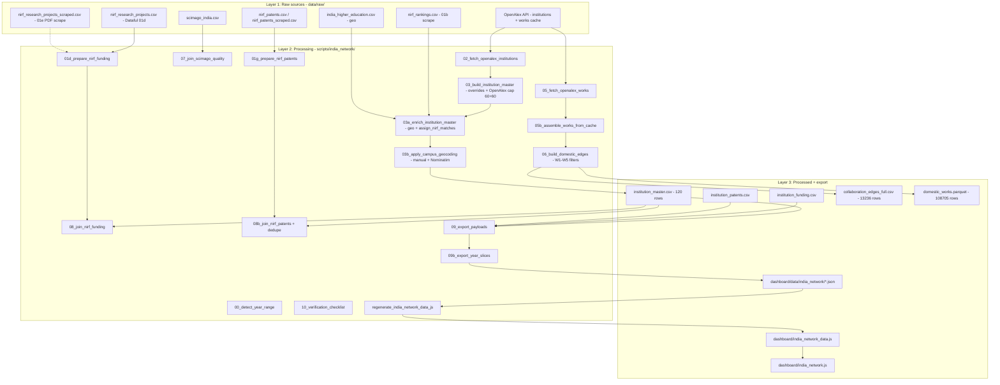

> **Audit snapshot:** 2026-07-07 · Read-only pipeline audit (no code or data changes during audit).
>
> **Post-audit updates:** Commit [`40a71aa`](https://github.com/bratadeepsarkar123/CS661/commit/40a71aa) (*Fix NIRF institute ID collisions with name-first matching*) landed after this audit. It updates `nirf_utils.py`, `03a_enrich_institution_master.py`, `08_join_nirf_funding.py`, `08b_join_nirf_patents.py`, and re-exports dashboard bundles. That work addresses P0/P1 NIRF matching and partial funding attribution fixes described below. Re-run verification and re-audit funding coverage after that pipeline completes. The body below is preserved as the historical audit record.

# Graph 5 (India Domestic HE Network) — Pipeline Audit Report

**Workspace:** `C:\Users\brata\Downloads\CS661`  
**Mode:** Read-only analysis (no files modified)  
**Snapshot date:** 2026-07-07

---

## Pipeline map



**Ordered run sequence (as implemented):**

| Stage | Script | Primary output |
|-------|--------|----------------|
| 00 | `00_detect_year_range.py` | `year_range.json` (YEAR_MAX=2024) |
| 01 | `01_download_sources.py` | Manual download checklist |
| 01b | `01b_scrape_nirf_rankings.py` | `nirf_rankings.csv` (860 rows, 796 IDs) |
| 01d | `01d_prepare_nirf_funding.py` | `nirf_funding_by_institute.csv` |
| 01e | `01e_scrape_nirf_funding_from_pdfs.py` | `nirf_research_projects_scraped.csv` → merges to alias |
| 01f/01g | patent scrape + normalize | `nirf_patents_by_institute.csv` (42 institutes) |
| 02 | `02_fetch_openalex_institutions*.py` | `openalex_institutions.parquet` |
| 03 | `03_build_institution_master.py` | 120-row master (60 premier + 60 state) |
| 03a | `03a_enrich_institution_master.py` | NIRF IDs/ranks + geo fill |
| 03b | `03b_apply_campus_geocoding.py` | Campus lat/lon overrides |
| 04 | `04_feasibility_domestic_edges.py` | Feasibility gate report |
| 05/05b | OpenAlex works fetch + assemble | `works_raw.parquet`, `domestic_works.parquet` |
| 06 | `06_build_domestic_edges.py` | `collaboration_edges_full.csv`, `hub_flags.csv` |
| 06b | `06b_build_collaboration_triads.py` | `collaboration_triads.parquet` |
| 07 | `07_join_scimago_quality.py` | `institution_quality_static.csv` |
| 08 | `08_join_nirf_funding.py` | `institution_funding.csv` |
| 08b | `08b_join_nirf_patents.py` | `institution_patents.csv` |
| 09/09b | export payloads + year slices | `dashboard/data/india_network/`, `public/india_network/` |
| 10 | `10_verification_checklist.py` | `verification_report.md` |
| — | `regenerate_india_network_data_js.py` | `dashboard/india_network_data.js` |

---

## Critical issues (P0)

### P0-1 — Corrupt NIRF institute IDs in raw funding CSV (mis-attribution)

**Source:** `data/raw/nirf_research_projects.csv` (Dataful)  
**Propagates through:** `01d_prepare_nirf_funding.py` → `08_join_nirf_funding.py` → dashboard

| Institute row name | Wrong `institute_id` in raw | ID actually belongs to | Funding joined (₹ cr) |
|--------------------|------------------------------|------------------------|----------------------|
| IIT Bhilai | `IR-O-I-1074` | IIT Delhi | **333.41** |
| IIT Jammu | `IR-O-I-1075` | IIT Kanpur | **215.18** |
| IIT Dharwad | `IR-O-U-0013` | IIT Hyderabad | **79.77** |

These amounts match the **parent** institutes' scale (Delhi ~333 cr, Kanpur ~215 cr, Hyderabad ~80 cr), not the newer campuses. The join script correctly matches by **name** (`name_norm`), so it faithfully imports corrupt source values.

**UI impact:** IIT Bhilai shows `research_funding_cr: 333.41` with `funding_status: "reported"` in `dashboard/data/india_network/2024_full.json` — visually credible but **wrong attribution**.

**Where to fix:** Validate/repair in `01d_prepare_nirf_funding.py` (ID cross-check against `nirf_rankings.csv`); prefer `01e_scrape_nirf_funding_from_pdfs.py` per-institute PDFs; add sanity check in `08_join_nirf_funding.py` rejecting rows where attached ID's canonical NIRF name similarity < threshold.

---

### P0-2 — Major IITs missing from funding source entirely

**Absent from `nirf_research_projects.csv`:** IIT Kanpur, IIT Delhi, IIT Madras (0 rows each).  
**Also missing funding after join:** IIT Bhubaneswar, Hyderabad, Patna, Ropar, Mandi, Palakkad, plus many central/state universities.

**Current coverage:** **87/120** with funding (not 116/120 as stale verification claims).

| Institute | NIRF ID | Patents | Funding |
|-----------|---------|---------|---------|
| IIT Kanpur | IR-O-I-1075 (#5 Overall) | 52 reported | **missing** |
| IIT Delhi | IR-O-I-1074 (#4 Overall) | 108 reported | **missing** |
| IIT Madras | IR-O-U-0456 (#1 Overall) | 247 reported | **missing** |
| IIT Hyderabad | IR-O-U-0013 (#12 Overall) | 28 reported | **missing** |

Patents exist for these (from Innovation PDF scrape in `nirf_patents.csv`) but funding pipeline never ingested their sponsored-research tables.

**Where to fix:** Re-run `01e_scrape_nirf_funding_from_pdfs.py` targeting missing institutes; merge scraped rows into `nirf_research_projects.csv`; re-run `01d` → `08` → `09` → `regenerate_india_network_data_js.py`.

---

### P0-3 — NIRF rank category mislabeled in UI (~40 institutes)

`assign_nirf_matches()` in `nirf_utils.py` stores the **best category's rank** (Engineering, Medical, Pharmacy, etc.) but `dashboard/india_network.js` always renders:

```309:309:dashboard/india_network.js
        <div class="inst-stat-row"><span>NIRF rank (Overall)</span><strong>${node.nirf_rank != null ? "#" + node.nirf_rank : "—"}</strong></div>
```

**Examples of wrong label:**

| Institute | Displayed rank | Actual category |
|-----------|---------------|-----------------|
| IIT Bhilai | #73 | Engineering only (no Overall row) |
| IIT Bhubaneswar | #54 | Engineering |
| AIIMS Delhi | #1 | Medical |
| NIT Surat | #59 | Engineering |
| University of Calcutta | #5 | Management |
| Central University of Rajasthan | #29 | Pharmacy |

This is **misleading attribution** in the detail panel, not a collision.

**Where to fix:** Store `nirf_ranking_category` in `03a` / export in `09_export_payloads.py`; update UI label dynamically.

---

## High issues (P1)

### P1-1 — NIRF ID collisions: resolved in master, but losers remain unmatched

`collision_audit.txt` and current data: **0 duplicate NIRF IDs** in `institution_master.csv` (97/120 matched).  
`assign_nirf_matches()` "first-claim by score" works, but **23 institutes have no NIRF ID**, including:

- IIT Goa, IIT Dharwad (not in NIRF 2024 rankings)
- SRM Institute of Science & Technology — best match IIT Madras `IR-O-U-0456` (score 0.752) **blocked** because Madras claimed it
- University of Rajasthan — wanted `IR-P-U-0392` (Pharmacy) but **Central University of Rajasthan** holds it via override

**Risk:** Fuzzy-match losers silently lose NIRF metadata; no audit log of "blocked by claimed_id".

**Where to fix:** `nirf_utils.py` `assign_nirf_matches()` — emit collision/loser report; expand `data/nirf_institute_id_overrides.csv`.

---

### P1-2 — Patent coverage severely incomplete (42/120)

| Status | Count |
|--------|-------|
| reported | 42 |
| unavailable | 74 |
| unranked | 4 |

Only **14/23 IITs** have patent counts. Missing IITs include Bhilai, Goa, Jammu, Dharwad, Bhubaneswar, Patna, Palakkad (among others). Root cause: `nirf_patents.csv` only has 42 institutes from Innovation PDF scrape; `01f` did not reach all master institutions.

`nirf_coverage_gaps.md` is **outdated** (claims 116/120 funding).

---

### P1-3 — Stale verification artifacts

| Artifact | Claims | Current reality |
|----------|--------|-----------------|
| `data/processed/verification_report.md` | 15/15 pass, 116/120 funding | **87/120** funding; checklist thresholds not re-run |
| `data/processed/nirf_coverage_gaps.md` | 116/120 funding | Stale |
| `collision_audit.txt` | 0 collisions | Still accurate |

`data/logs/verification_report.json` and `pipeline_state.json` were **not found** at expected paths.

---

### P1-4 — Duplicate funding values across unrelated institutes

Remaining duplicate clusters in `institution_funding.csv`:

| Amount (₹ cr) | Institutes sharing value | Likely cause |
|---------------|-------------------------|--------------|
| 197.08 | AIIMS Delhi + IMS Varanasi | Name/fuzzy match or shared raw row |
| 19.84 | NIT Durgapur + Punjabi University | Raw source duplication |
| 127.31 | TNAU + Punjab Agricultural University | Agricultural univ. data pattern |
| 0.62 | University of Rajasthan + Central Univ. Rajasthan | Entity confusion |

---

### P1-5 — Dashboard bundle sync

- `dashboard/data/india_network/` ↔ `public/india_network/`: **MD5 match** for `2024_full.json` and `manifest.json`
- `india_network_data.js` embeds Bhilai funding **333.41** — consistent with JSON but **wrong data**
- After funding fixes, must re-run: `09_export_payloads.py` → `09b_export_year_slices.py` → `regenerate_india_network_data_js.py`
- `hierarchy-app/dist/india_network/` has only partial year files (stale fork)

---

## Medium / Low (P2/P3)

| ID | Issue | Severity |
|----|-------|----------|
| P2-1 | `IR-O-I-*` IDs look like "Innovation" prefix but are valid **Overall** IDs for old IITs (Kanpur `IR-O-I-1075` = Overall #5) — confusing for maintainers | P2 |
| P2-2 | Coordinate stack: KIIT + Siksha O Anusandhan share `(20.356, 85.814)` — 2 institutes, acceptable per verification (max stack ≤2) | P2 |
| P2-3 | `08_join_nirf_funding.py` comment says "name match authoritative" but ID lookup at score 0.95 can still propagate bad IDs if name_norm collides | P2 |
| P2-4 | OpenAlex auto-added institutions use `display_name` as `canonical_name` — inconsistent naming vs manual IIT list | P3 |
| P2-5 | SCImago is static 2019 for all years — documented in `quality_note`, correct behavior | P3 (known) |
| P3-1 | `01_download_sources.py` lists AISHE xlsx as required but file not present in `data/raw/` | P3 |
| P3-2 | Plan doc (`india_domestic_he_network_plan.md`) references scripts `07_build_institution_metrics.py`, `08_compute_tier_aggregates.py` that don't exist — doc drift | P3 |

---

## Per-stage findings

| Script | Inputs | Transforms | Outputs | Risks / failure modes |
|--------|--------|------------|---------|----------------------|
| `01b_scrape_nirf_rankings` | nirfindia.org HTML | Parse ranking tables per category | `nirf_rankings.csv` | HTML structure changes; multi-category IDs per institute |
| `01d_prepare_nirf_funding` | Dataful CSV | Group by `name_norm`, max amount | `nirf_funding_by_institute.csv` | **Does not validate institute_id vs name**; propagates Dataful ID errors |
| `01e_scrape_nirf_funding` | NIRF PDFs per master ID | pdfplumber extract | scraped CSV | Misses Kanpur/Delhi/Madras; overwrites alias path |
| `01g_prepare_nirf_patents` | patents CSV | Group by institute | 42-institute summary | Only institutes in raw file |
| `03_build_institution_master` | overrides + OpenAlex | Fuzzy match, tier caps 60+60 | 120 rows | Fuzzy OpenAlex match threshold 0.72; stub rows without geo |
| `03a_enrich_institution_master` | master + NIRF + geo | `assign_nirf_matches`, geo fill | NIRF columns | **Losers silent**; no category stored |
| `03b_apply_campus_geocoding` | master | Manual `MANUAL_CAMPUS` + Nominatim | campus coords | Corridor stacking intentional (Delhi 6, Mumbai 4, etc.) |
| `05/05b` OpenAlex works | API cache | W1-W5 filters | domestic works | API key required; resource caps |
| `06_build_domestic_edges` | domestic works | Pairwise co-auth, weight≥2 | 13236 edge rows | Foreign co-auth exclusion tested (PASS) |
| `08_join_nirf_funding` | master + funding summary | Name-first join, fuzzy fallback | per-inst funding | Imports corrupt raw; no ID sanity check |
| `08b_join_nirf_patents` | master + patents | ID join + `_dedupe_patent_collisions` | patent status | Mismatched master/patent IDs → unavailable |
| `09_export_payloads` | all processed | Node cap 120, edge cap 300 | JSON payloads | Static funding/patents across all year slices |
| `10_verification_checklist` | processed + dashboard | 15 checks | report md/json | **Not re-run** after recent funding changes |
| `nirf_utils.py` | rankings + overrides | Fuzzy match, claimed-ID dedupe | shared logic | Threshold 0.78/0.72; token blocking |

---

## Data quality metrics

| Metric | Value |
|--------|-------|
| Institutions in master | 120 (60 premier / 60 state) |
| Geo coverage (lat/lon) | 120/120 (100%) |
| NIRF ID assigned | 97/120 (23 missing) |
| NIRF ID collisions in master | **0** |
| Funding joined | **87/120** (33 missing) |
| Patents joined | **42/120** |
| Patent status: unavailable | 74 |
| Domestic works | 108,705 rows |
| Collaboration edges (weight≥2) | 13,236 |
| Dashboard 2024_full nodes/edges | 120 / 300 |
| SCImago coverage | 111/111 in quality file |
| Institutes with non-Overall rank shown as Overall | **~40** |
| Corrupt funding raw rows (confirmed) | **3** (Bhilai, Jammu, Dharwad) |
| Duplicate funding value clusters | 4 |

---

## Recommended fixes (do not implement — location only)

| Priority | Fix | Where |
|----------|-----|-------|
| P0 | Add ID↔name validation in funding normalize; flag/reject when `institute_id` maps to different NIRF name | `01d_prepare_nirf_funding.py` |
| P0 | Scrape PDF funding for Kanpur, Delhi, Madras, Hyderabad, etc. | `01e_scrape_nirf_funding_from_pdfs.py` + re-run `01d`, `08` |
| P0 | Null out or mark `funding_status: "suspect"` for Bhilai/Jammu/Dharwad until raw fixed | `08_join_nirf_funding.py`, `09_export_payloads.py` |
| P0 | Export and display `nirf_ranking_category`; fix UI label | `03a`, `09_export_payloads.py`, `dashboard/india_network.js` |
| P1 | Log NIRF match losers in `assign_nirf_matches` | `nirf_utils.py`, new report in `data/processed/` |
| P1 | Expand patent PDF scrape to all 97 NIRF-ranked institutes | `01f_scrape_nirf_patents_from_pdfs.py` |
| P1 | Re-run `10_verification_checklist.py`; update funding threshold to match reality | `10_verification_checklist.py` |
| P1 | After any processed change: `09b` + `regenerate_india_network_data_js.py` | export scripts |
| P2 | Add funding duplicate-value detector (same ₹ cr, different inst_types) | new check in `10_verification_checklist.py` |
| P2 | Overrides for IIT Dharwad, IIT Goa when NIRF adds them | `data/nirf_institute_id_overrides.csv` |

---

## Institutes to spot-check in UI

| Institute | Expected concern | Current processed state | Dashboard concern |
|-----------|-------------------|------------------------|-------------------|
| **IIT Kanpur** | Top-5 Overall, high funding | NIRF #5 ✓; funding **missing**; patents 52 ✓ | Panel shows funding unavailable — correct given data, wrong for story |
| **IIT Delhi** | Top-5 Overall, hub | NIRF #4 ✓; funding **missing**; patents 108 ✓ | Same |
| **IIT Madras** | #1 Overall | NIRF matched; funding **missing**; patents 247 ✓ | Tier headline skewed |
| **IIT Bhilai** | New IIT, low funding | NIRF Eng #73; funding **333.41 (WRONG — Delhi's)** | **Shows reported funding — false positive** |
| **IIT Jammu** | New IIT | Eng #62; funding **215.18 (likely Kanpur's)** | Suspect reported funding |
| **IIT Dharwad** | Not in NIRF 2024 | No NIRF ID; funding **79.77 (likely Hyderabad's)** | Reported funding without NIRF rank — inconsistent |
| **IIT Hyderabad** | Top-15 Overall | NIRF #12 ✓; funding missing; patents 28 ✓ | OK except missing funding |
| **IISc Bengaluru** | #2 Overall, high metrics | All fields populated ✓ | Good reference node |
| **NIT Surat** | Engineering rank | Shows as "Overall" #59 | **Wrong category label** |
| **NIT Durgapur** | Patents + funding | Patents unavailable; funding 19.84 (shared with Punjabi Univ) | Duplicate funding suspicion |
| **AIIMS Delhi** | Medical #1 | Rank shown as "Overall" #1 | **Wrong category label** |
| **SRM / Saveetha** | Tamil Nadu privates | No NIRF ID (SRM blocked by Madras ID) | Missing NIRF rank entirely |

---

## Cross-check summary (raw → processed → dashboard)

| Institute | Raw funding row | Processed funding | Dashboard `2024_full` | Verdict |
|-----------|----------------|-------------------|----------------------|---------|
| IIT Delhi | **No row** | null | null, `unavailable` | Missing (correct given source) |
| IIT Kanpur | **No row** | null | null, `unavailable` | Missing |
| IIT Bhilai | Row with **Delhi's ID** `IR-O-I-1074`, 333.41 cr | 333.41 | 333.41, `reported` | **Corrupt — do not trust** |
| IIT Dharwad | Row with **Hyderabad ID** `IR-O-U-0013`, 79.77 cr | 79.77 | 79.77, `reported` | **Corrupt — do not trust** |
| IIT Hyderabad | **No row** (JNTU Hyderabad separate) | null | null | Missing |
| IISc | Valid row | 534.77 | 534.77 | OK |

---

## Systemic patterns (not one-off bugs)

1. **Dataful NIRF funding CSV attaches wrong `institute_id` to newer IIT campus names** — systemic in source, not join logic.
2. **Legacy IITs (Kanpur, Delhi, Madras) absent from Dataful funding export** — PDF scrape path required.
3. **NIRF multi-category IDs** — same numeric suffix (`1074`, `1075`) appears across Overall/Engineering/Innovation; pipeline must never key only on suffix.
4. **`assign_nirf_matches` uniqueness** — correct for collisions but creates a long tail of unmatched institutes without visibility.
5. **Rank without category** — ~33% of ranked institutes display misleading "Overall" label.
6. **Verification drift** — automated checklist passed on older data; current processed files have regressed funding coverage.

---

## What is working well

- **NIRF ID collisions in master: 0** (post `assign_nirf_matches`)
- **OpenAlex ID uniqueness: 0 duplicates**
- **Geo: 100% coverage**, coordinates within India bounds
- **Collaboration graph:** IIT Kanpur ↔ IIT Delhi edge exists; foreign co-auth exclusion passes
- **Dashboard JSON integrity:** 0 orphan edges; `dashboard/` and `public/` in sync
- **Patent dedupe:** 0 `duplicate_resolved` rows currently
- **domestic_works.parquet:** 108,705 rows, non-empty

---

*Note: Another agent is actively fixing NIRF matching root cause. Current `institution_funding.csv` on disk already shows Kanpur/Delhi/Hyderabad funding cleared (null) while Bhilai/Jammu/Dharwad corrupt values remain — consistent with a partial in-progress fix. Re-audit after their changes land and re-export completes.*
