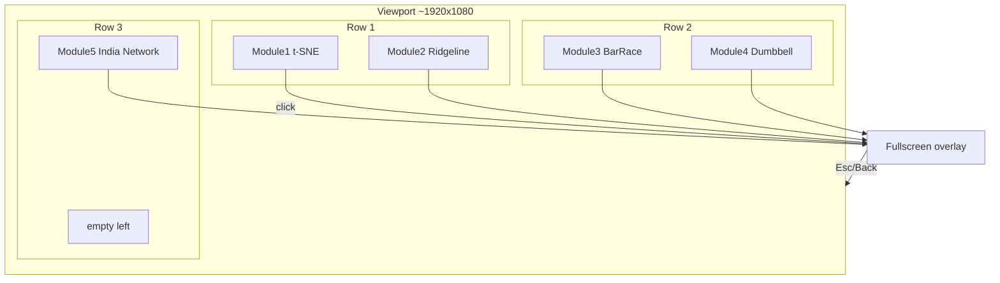
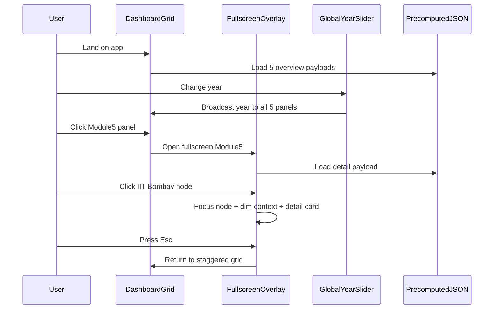

# Lecture-Grounded Five-Panel Dashboard Plan

**Project:** CS661 — *The Global Knowledge & Wealth Paradox*  
**Purpose:** Map lecture principles + project docs to a five-panel dashboard with staggered 2-2-1 layout and click-to-fullscreen focus+context views.

---

## 1. What we analyzed

### Source corpus

| Source | Path | Status |
|--------|------|--------|
| Lecture markdown (17 files) | `markdown_files/markdown_files/` | Text usable for L1–12, L9–10; **L13, L15, L16, L17 corrupted** (bullet-per-character OCR) |
| Lecture PDFs (fallback) | `markdown_files/lecture pdf/` | 17 PDFs present; use for slides with missing/broken images |
| Official proposal | `CS661_PROJECT.md` | **7 visualization modules** (4.1–4.7) |
| Evolved team design | `CS661 project notes.docx` + `_docx_extract/word/media/image1–5.png` | **5 wireframe panels** — this is what you are building |
| Module 5 master plan | `india_domestic_he_network_plan.md` | Most mature spec (~620 lines) |
| Module 2 handoff | `global_quality_shift_agent_handoff.md` | Ridgeline template |
| Course requirements | `markdown_files/markdown_files/Details for Course Project.md` | 5–6 interactive viz, no long scroll, custom code |
| App scaffold | `hierarchy-app/` | React+Vite+Tailwind; mock tree viz only — **not** the final dashboard |
| D3 POCs | `animation.html`, `scatter.html`, `index.html` | Python→JSON→D3 pattern to reuse |

### Markdown quality notes

- **No embedded slide images** in any lecture `.md` — diagrams (Gestalt, t-SNE, focus+context, colormaps) exist only in PDFs.
- **Lectures 13, 15, 16, 17**: markdown is garbled; read PDFs for distribution modeling, GMM/KDE, copulas, sampling.
- **Lectures 1–12** (except missing L14): slide text is readable and sufficient for design rules.

### Proposal vs evolved dashboard (important reconciliation)

The official proposal lists **7 modules** (choropleth R&D, PPP bubble, outlier scatter, bubble pack, publish-or-perish scatter+donut, India treemap, global collaboration network). The team **compressed** these into **5 panels** aligned with docx wireframes:

| Panel | Evolved module | Absorbs from proposal |
|-------|----------------|----------------------|
| 1 | t-SNE peer clustering | 4.2 PPP reality + 4.3 efficiency anomalies + macro clustering |
| 2 | Global Quality Shift ridgeline | 4.5 publish-or-perish (Q1/Q4 story) |
| 3 | Top-10 research topics bar race | Field filter story from 4.5 |
| 4 | Collaboration Premium dumbbell | 4.7 citation multiplier |
| 5 | India Domestic HE network | 4.6 India deep-dive (treemap → geo network) |

**Dropped from visible UI** (can appear as footnotes or future expansion): 4.1 wealth-to-R&D choropleth, 4.4 scale-vs-excellence bubble pack. Document this mapping in the final report so graders see 5+ analytical tasks across merged stories.

---

## 2. Global UI architecture (staggered layout)

**Staggered 2-2-1 layout** with minimal scroll on a single viewport (~1080p):



**Layout rules (lecture-backed):**

- **No long scrolling dashboard** — course requirement; at most ~5% vertical overflow on smaller laptops.
- **Two-level UI** (Lecture 10: Overview + Detail; Lecture 2: Shneiderman mantra):
  - **Level A (grid):** all 5 panels as compressed thumbnails — max **3 annotation callouts** each (7±2 rule, Lecture 2/10).
  - **Level B (fullscreen):** clicked panel fills viewport; others hidden; **Esc/Back** returns.
- **Focus + context inside fullscreen** (Lecture 2 slide 19; Lecture 10 Munzner Ch. 14): selected entity enlarged; rest dimmed but visible — **primary pattern for Module 5** and recommended for Modules 1, 2, 4.
- **Persistent global year slider** (1996–2024) — brush-and-link across panels (Lecture 10: linked views).
- **Dark theme** `#0f172a` — already in docx wireframes and `india_domestic_he_network_plan.md`.
- **Pre-computed JSON only** in browser — no live API calls at demo time (distribution summarization principle from Lecture 15 PDF: compact payloads).

### Shared React structure (replace current tree in `hierarchy-app/src/App.jsx`)

```
hierarchy-app/src/
  components/
    layout/
      DashboardGrid.jsx       # staggered 2-2-1 CSS grid
      PanelCard.jsx             # thumbnail wrapper + click handler
      FullscreenOverlay.jsx     # portal, focus trap, Esc handler
      GlobalYearSlider.jsx      # cross-filter state
    modules/
      Module1_TSNE/
      Module2_Ridgeline/
      Module3_BarRace/
      Module4_Dumbbell/
      Module5_IndiaNetwork/
  hooks/
    useDashboardState.js        # { activeModule, year, expandedPanel }
  public/data/
    module1_tsne.json
    module2_ridgeline.json
    ...
```

Add **d3** to `hierarchy-app/package.json` (used in root POCs but not yet in React app).

---

## 3. Lecture principles → project contract

Create one reference file: `references/lecture_design_contract.md` with these bindings:

| Principle | Lecture | Project rule |
|-----------|---------|--------------|
| Overview → zoom/filter → details | L2 slides 15–18 | Grid thumbnails → fullscreen → click/hover detail |
| Focus + context | L2 slide 19; L10 Ch. 14 | Fullscreen node/year/country selection with dimmed context |
| 7±2 colors/categories | L2 slide 25; L10 slide 44 | Max 2 tier colors (Module 5); max 3 story labels on overview |
| Graphical integrity / lie factor | L10 slides 15–40 | √ area for node size; no 3D bars; mandatory footnotes |
| Chartjunk reduction | L10 slide 43 | No decorative grids on maps; no red glow on ridgeline overview |
| Facet / linked views | L10 slides 52–58 | 5 panels + global year slider = linked small multiples |
| Visual variables | L2 slides 7–11 | Position=geo or DR; size=volume; color=tier/region; width=edges |
| t-SNE caveats | L11–12 | Pre-compute embeddings per year; warn "distances not literal" in fullscreen |
| Distribution summarization | L15 PDF | Ridgeline uses pre-computed KDE/GMM bins, not raw per-paper data in browser |
| High-dim preprocessing | L2 slides 28–31 | Normalize GERD, PPP, citations before t-SNE |
| D3 as web viz toolkit | L9 slide 17 | React + D3 (course-allowed, matches proposal) |

**Scientific viz lectures (L3–L8):** VTK, volume rendering, ParaView — relevant to **Assignment 1**, not the InfoVis dashboard. Skip for UI design; keep for course report "related techniques" section only.

---

## 4. Per-module plan (overview vs fullscreen)

### Module 1 — High-Dimensional Peer Clustering (top-left)

**Story:** Countries morph from geographic similarity to performance clusters (China→elite; Gulf→Europe; docx Image 1).

| Level | Show | Hide | Lecture basis |
|-------|------|------|---------------|
| Overview | ~50 country dots, 2 cluster labels, play/pause icon | Trajectory trails, per-country labels | Munzner Ch. 13 |
| Fullscreen | Animated t-SNE 1996–2024, trails for selected countries, region legend | Raw 15-D feature table | L11–12 t-SNE; L2 planar+color encoding |
| Focus+context | Click country → highlight trail + dim others | — | L10 focus+context |

**ETL:** New `scripts/tsne_clustering/` — World Bank + SCImago + UIS → yearly feature matrix → sklearn `TSNE` → JSON (mirror `scripts/india_network/` pattern).

**POC reuse:** `animation.html` trajectory + year slider logic.

---

### Module 2 — Global Quality Shift ridgeline (top-right)

**Story:** 1996 parity → Elite Breakaway vs Q4 Flood bimodal split (docx Image 2).

| Level | Show | Hide | Lecture basis |
|-------|------|------|---------------|
| Overview | 3 labels: Parity, Q4 Flood, Elite Breakaway | Per-country curves | 7±2; Munzner Ch. 13 |
| Fullscreen | Full ridgeline stack 1996–2024, hover isolates one year | Decorative gradients | L10 distribution viz; L15 KDE pre-compute |
| Focus+context | Hover year → highlight curve, sidebar stats | — | Shneiderman details-on-demand |

**ETL:** Follow `global_quality_shift_agent_handoff.md` — SCImago Q1/Q4 per country per year → KDE per year → compact JSON.

---

### Module 3 — Top-10 Research Topics bar race (middle-left)

**Story:** Field prominence shifts (AI, CRISPR, COVID, etc.; docx Image 3).

| Level | Show | Hide | Lecture basis |
|-------|------|------|---------------|
| Overview | Top 5 bars + year | Full 10-bar animation | Reduce items |
| Fullscreen | 10-bar race, play/pause, speed | Topic descriptions | L10 trend/time-series |
| Focus+context | Click topic → trend sparkline in sidebar | — | L10 overview+detail |

**ETL:** OpenAlex concepts aggregated by year → top-10 ranking JSON.

---

### Module 4 — Collaboration Premium dumbbell (middle-right)

**Story:** International co-authorship citation multiplier by country (docx Image 4).

| Level | Show | Hide | Lecture basis |
|-------|------|------|---------------|
| Overview | Top 8 countries by gain, one insight line | All 40+ countries | Munzner Ch. 13 |
| Fullscreen | Full dumbbell chart, sort controls | — | L10 comparative viz |
| Focus+context | Click country → highlight pair + gain annotation | — | L10 graphical integrity (label the gain) |

**ETL:** OpenAlex works → domestic vs intl co-auth citation rates per country.

---

### Module 5 — India Domestic HE Network (bottom-right)

**Story:** Elite blue hubs vs purple state tier; domestic co-publication geography (docx Image 5).

This module already has the strongest plan in `india_domestic_he_network_plan.md`. Key lecture-aligned decisions to **keep**:

| Encoding | Value | Lecture rule |
|----------|-------|--------------|
| Position | India lat/lon | L2 planar (strongest) |
| Color | 2 tiers only (Premier `#3b82f6`, State `#a855f7`) | 7±2 |
| Node area | √(`total_works`) | Tufte lie factor |
| Edge width | domestic co-pub count | L2 size variable |
| Overview | ~12 hub labels, hub-to-hub edges only | Shneiderman overview |
| Fullscreen | ~80 nodes, tier side panels, Funding \| Publications tabs on click | Focus+context (Munzner Ch. 14) |
| Footnote | "~120 research-active institutions on map; ~40k affiliated in tier averages" | Tufte integrity |

**Recommended change from docx Image 5:** Move dual side panels (pie, radial gauges) to **fullscreen only** — docx prototype violates Lecture 2/10 working-memory limits if shown in the small staggered cell.

**ETL status:** `scripts/india_network/` complete — 120/120 OpenAlex cache, feasibility gate **PASS**, dashboard JSON exported, verification **11/11**. UI in `dashboard/india_network.js` (focus+context, year slider, NIRF status fields).

**Do not use** `hierarchy-app/src/App.jsx` tree viz as Module 5 — it is a separate hierarchy experiment (unused React scaffold; working shell is `dashboard/`).

---

## 5. Cross-cutting interaction model



**Interactions required by course** (minimum per panel): filtering (year), selection (click), querying (sort/search in fullscreen), linked highlighting (year slider).

---

## 6. Recommended changes to initial plans

| Current idea | Recommended adjustment | Why |
|--------------|------------------------|-----|
| Staggered 2-2-1 layout | **Adopt** | Fits "little scroll"; Module 5 gets largest cell |
| Docx 3+2 top/bottom grid | Deprecate for layout | Superseded by staggered choice |
| Module 5 side panels always visible | **Fullscreen only** | Lecture 2/10 cognitive load |
| 7 proposal modules all visible | **Merge into 5**; document mapping in report | Course needs 5–6 viz, not 7 crowded panels |
| hierarchy-app tree | **Replace** with dashboard grid | Wrong viz type for Module 5 |
| Live OpenAlex in browser | **Reject** | Performance + demo reliability |
| Ridgeline red/blue glow on overview | **Remove** | Chartjunk (L10) |
| Per-country labels on t-SNE overview | **Remove** | Munzner Ch. 13 |

---

## 7. Implementation phases

### Phase 0 — Reference artifacts

- Write `references/lecture_design_contract.md` mapping all 17 lectures to design rules
- Write `dashboard_architecture.md` with staggered layout spec + module JSON schemas
- Create master plan stubs for Modules 1, 3, 4 (mirror Module 5 / Module 2 handoff format)

### Phase 1 — Shell

- Refactor `hierarchy-app` → `DashboardGrid` + `FullscreenOverlay` + `GlobalYearSlider`
- Placeholder panels with mock JSON; verify Esc/click flow

### Phase 2 — ETL parallel tracks

- Module 5: fix OpenAlex domestic edge feasibility (blocking)
- Module 2: ridgeline pipeline per handoff doc
- Modules 1, 3, 4: new `scripts/` folders

### Phase 3 — D3 modules

- Port POC patterns from `animation.html` / `scatter.html` into React+D3 components
- Module 5 last or parallel once ETL passes

### Phase 4 — Polish for demo

- Tufte footnotes on every panel
- README with run instructions (course requirement)
- Screenshot set for report

---

## 8. Lecture reading guide

**Read markdown first, PDF when images/stats matter:**

| Priority | Files | Use for |
|----------|-------|---------|
| P0 | L2, L9, L10 `.md` + PDFs for focus+context slides | All modules — core design contract |
| P0 | L11, L12 `.md` | Module 1 t-SNE |
| P1 | L15, L13 PDFs (not `.md`) | Module 2 ridgeline KDE/GMM |
| P1 | `india_domestic_he_network_plan.md`, docx Image 5 | Module 5 |
| P2 | L16 PDF | Multivariate copula if advanced ridgeline |
| P3 | L3–L8 | Assignment 1 only |
| P3 | L17 PDF | Sampling if ETL subsampling needed |

---

## 9. Success criteria

- All 5 panels visible in staggered grid without meaningful scroll on 1080p
- Click any panel → fullscreen → focus+context interaction works
- Global year slider updates all 5 panels
- Every panel cites ≥2 lecture principles in design doc / report
- Module 5 shows India map with 2-tier encoding + integrity footnote
- Pre-computed JSON loads in under 100ms per panel
- Course constraints met: custom React+D3, no Tableau/PowerBI, 5–6 interactive viz, GitHub + README

---

## 10. Implementation checklist

- [ ] Write `references/lecture_design_contract.md` (L1–L17; use PDFs for L13, L15–L17)
- [ ] Refactor `hierarchy-app`: staggered 2-2-1 grid + fullscreen overlay + year slider + d3
- [ ] Create master plan stubs for Modules 1, 3, 4
- [ ] Module 2 ridgeline ETL per `global_quality_shift_agent_handoff.md`
- [ ] Fix Module 5 OpenAlex domestic edge feasibility in `scripts/india_network/`
- [ ] Build Module 5 India network React+D3 (overview + fullscreen focus+context)
- [ ] Wire global year slider to all 5 panel payloads
- [ ] Tufte footnotes, README, screenshots for submission
